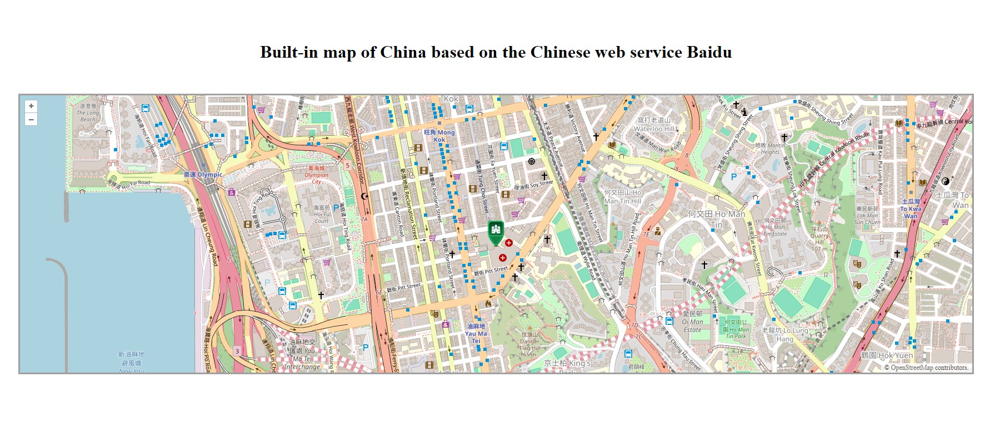

# Built-in map of China based on the Chinese web service Baidu

---

On a foreign forum I found a tool to access some unlocked tile servers.

For a small DIY project, I connected a third-party tool that was posted by user AlexUrquhart on the [reddit.com](https://www.reddit.com/) forum. The tool allows you to easily browse a list of tile servers and see what they look like (and also check if they are blocked). It also generates a few lines of code in JsFiddle or Code Pen that you can use to host the map on your website.
